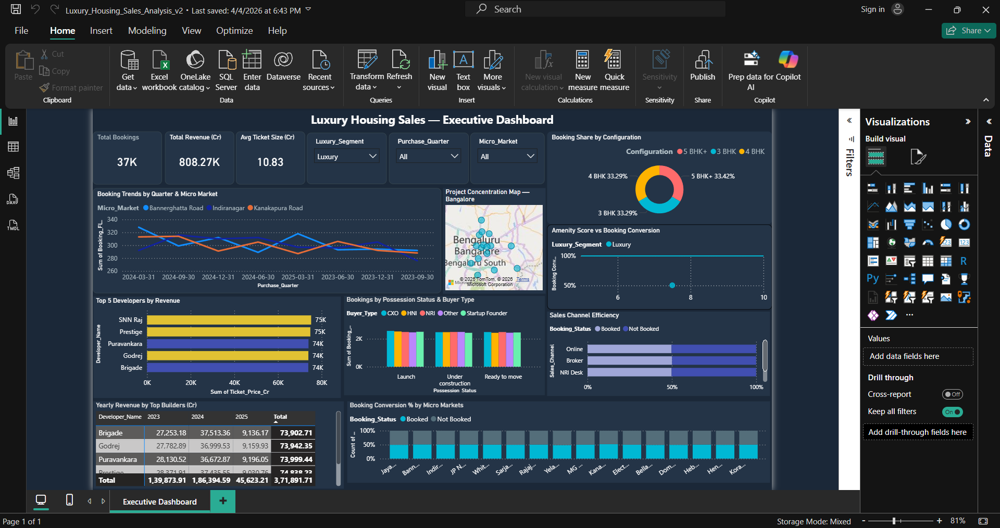
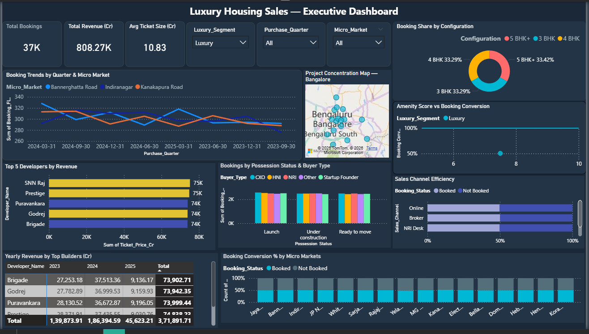

# 🏠 Luxury Housing Sales Analysis — Bangalore

An end-to-end Exploratory Data Analysis (EDA) project on **luxury real-estate transactions in Bangalore, India**. The analysis covers data cleaning, feature engineering, univariate & multivariate exploration, and finally loads the cleaned dataset into a **PostgreSQL** database with a **Power BI** dashboard layer on top.

---

## 📌 Table of Contents

- [Project Overview](#project-overview)
- [Dataset](#dataset)
- [Tech Stack](#tech-stack)
- [Project Structure](#project-structure)
- [Analysis Pipeline](#analysis-pipeline)
  - [1. Data Loading & Inspection](#1-data-loading--inspection)
  - [2. Data Cleaning](#2-data-cleaning)
  - [3. Feature Engineering](#3-feature-engineering)
  - [4. Exploratory Data Analysis (EDA)](#4-exploratory-data-analysis-eda)
  - [5. Export & Database Loading](#5-export--database-loading)
  - [6. Power BI Visualization](#6-power-bi-visualization)
- [Key Insights](#key-insights)
- [How to Run](#how-to-run)
- [Future Improvements](#future-improvements)

---

## Project Overview

This project analyzes **~100,000 luxury housing transactions** across 16 micro-markets in Bangalore. The goal is to uncover pricing trends, buyer behaviour, and market dynamics through comprehensive EDA and present actionable insights via interactive Power BI dashboards.

---

## Dataset

| Property | Detail |
|---|---|
| **Source file** | `luxury_housing_bangalore.csv` |
| **Records** | 101,000 (raw) → ~99,495 (after cleaning) |
| **Features** | 18 original columns |
| **Time span** | Q2 2023 – Q1 2025 |

### Original Columns

| Column | Type | Description |
|---|---|---|
| `Property_ID` | object | Unique property identifier |
| `Micro_Market` | object | Locality / area name (16 distinct) |
| `Project_Name` | object | Builder project name |
| `Developer_Name` | object | Developer (11 distinct, e.g. Sobha, Prestige, Embassy) |
| `Unit_Size_Sqft` | float | Unit area in sq ft |
| `Configuration` | object | BHK type (3 BHK, 4 BHK, 5 BHK+) |
| `Ticket_Price_Cr` | object → float | Transaction price in ₹ Crore |
| `Transaction_Type` | object | Primary / Secondary |
| `Buyer_Type` | object | NRI, HNI, CXO, Startup Founder, Other |
| `Purchase_Quarter` | object → datetime | Quarter of purchase |
| `Connectivity_Score` | float | Infrastructure connectivity score (4–10) |
| `Amenity_Score` | float | Amenity quality score (5–10) |
| `Possession_Status` | object | Launch / Under construction / Ready to move |
| `Sales_Channel` | object | Direct / Broker / Online / NRI Desk |
| `NRI_Buyer` | object | yes / no |
| `Locality_Infra_Score` | float | Local infrastructure score (5–10) |
| `Avg_Traffic_Time_Min` | int | Avg traffic commute time in minutes |
| `Buyer_Comments` | object | Free-text buyer feedback |

---

## Tech Stack

| Tool / Library | Purpose |
|---|---|
| **Python 3.12** | Core programming language |
| **Pandas** | Data manipulation & cleaning |
| **NumPy** | Numerical operations |
| **Matplotlib** | Static visualizations |
| **Seaborn** | Statistical visualizations |
| **SQLAlchemy** | Database connectivity & ORM |
| **PostgreSQL** | Relational database for cleaned data |
| **Power BI** | Interactive dashboards & reporting |
| **Jupyter Notebook** | Interactive analysis environment |

---

## Project Structure

```
LuxHousingSales/
│
├── lux_housin_sales.ipynb              # Main EDA notebook
├── db_loading.ipynb                    # Database loading notebook (PostgreSQL)
├── luxury_housing_bangalore.csv        # Raw dataset (~20 MB)
├── luxury_housing_cleaned_v2.csv       # Cleaned & feature-engineered dataset (~25 MB)
├── Luxury_Housing_Sales_Analysis.pbix  # Power BI dashboard file
└── README.md                           # This file
```

---

## Analysis Pipeline

### 1. Data Loading & Inspection

- Loaded dataset with **101,000 rows × 18 columns**.
- Performed initial inspection using `.info()`, `.describe()`, `.head()`, unique value checks, and null-value analysis.

### 2. Data Cleaning

| Issue | Action Taken |
|---|---|
| **1,000 duplicate `Property_ID`s** | Removed duplicates, keeping first occurrence |
| **Inconsistent `Micro_Market` casing** (e.g. `bellary road`, `BELLARY ROAD`, `Bellary Road`) | Standardized using `.str.strip().str.title()` with manual fixes for abbreviations (MG Road, JP Nagar) |
| **Inconsistent `Configuration`** (e.g. `4bhk`, `4Bhk`, `4BHK`) | Standardized to uppercase with space (`4 BHK`) |
| **`Ticket_Price_Cr` stored as string** with currency symbols (₹, Cr) | Stripped symbols, converted to float, rounded to 3 decimals |
| **5 negative `Ticket_Price_Cr` values** | Removed invalid negative rows |
| **~9,900 null `Ticket_Price_Cr` values** | Imputed with **median** |
| **500 negative `Unit_Size_Sqft` values** | Removed invalid negative rows |
| **~9,957 null `Unit_Size_Sqft` values** | Imputed with **median** |
| **~10,090 null `Amenity_Score` values** | Imputed with **median** |
| **~18,019 null `Buyer_Comments`** | Kept as-is (free-text, not imputed) |

> **Final cleaned shape:** 99,495 rows × 21+ columns

### 3. Feature Engineering

| New Feature | Logic |
|---|---|
| `Booking_Flag` | `1` if Primary transaction, `0` if Secondary |
| `Quarter_Number` | Quarter extracted from `Purchase_Quarter` (1–4) |
| `Year` | Year extracted from `Purchase_Quarter` |
| `Luxury_Segment` | Categorization into **Luxury** vs **Ultra Luxury** based on price thresholds |
| `Price_per_Sqft` | `Ticket_Price_Cr / Unit_Size_Sqft` |
| `Price_per_Sqft_INR` | Price per sq ft in ₹ |
| `Log_Ticket_Price_Cr` | Log transformation for normalization |
| `Log_Price_per_Sqft_INR` | Log transformation for normalization |

### 4. Exploratory Data Analysis (EDA)

#### Univariate Analysis
- **Ticket Price Distribution**: Right-skewed with a long tail of ultra-luxury properties. Median used for central tendency analysis.
- **Histograms** and **KDE plots** to understand price spread.
- **Box Plots** & **Violin Plots** to detect outliers — outliers kept as they represent genuine ultra-luxury transactions.

#### Bivariate & Multivariate Analysis
- Price comparison across **micro-markets**, **developers**, **BHK configurations**, and **buyer types**.
- Correlation analysis between scores (Connectivity, Amenity, Infrastructure).
- Quarterly booking trends over time.

### 5. Export & Database Loading

- Cleaned dataset exported to `luxury_housing_cleaned_v2.csv` (25 columns, 99,495 rows).
- Data loaded into a **PostgreSQL** database (`luxury_house_db`) using **SQLAlchemy + psycopg** via the `db_loading.ipynb` notebook.
- Designed a **star-schema** with **1 fact table** and **3 dimension tables**:

#### Database Schema

| Table | Type | Columns | Description |
|---|---|---|---|
| `fact_sales` | Fact | `Property_ID`, `Developer_Name`, `Ticket_Price_Cr`, `Price_per_Sqft_INR`, `Luxury_Segment`, `Booking_Flag`, `Purchase_Quarter`, `Quarter_Number`, `Year` | Core sales transaction facts |
| `dim_location` | Dimension | `Property_ID`, `Micro_Market`, `Locality_Infra_Score`, `Avg_Traffic_Time_Min` | Location & infrastructure attributes |
| `dim_property` | Dimension | `Property_ID`, `Unit_Size_Sqft`, `Configuration`, `Amenity_Score`, `Connectivity_Score`, `Possession_Status` | Property characteristics |
| `dim_buyer` | Dimension | `Property_ID`, `Buyer_Type`, `NRI_Buyer`, `Sales_Channel` | Buyer profile details |

> All tables are linked via `Property_ID` as the join key.

### 6. Power BI Visualization

- The Power BI dashboard (`Luxury_Housing_Sales_Analysis.pbix`) connects to the PostgreSQL database via **Direct SQL connection** for live, interactive reporting.
- A **SQL view** `vw_market_trends_luxury` was created in PostgreSQL to push aggregation logic to the database, improving Power BI performance:

```sql
CREATE OR REPLACE VIEW public.vw_market_trends_luxury AS
SELECT
    fs."Purchase_Quarter",
    dl."Micro_Market",
    COUNT(DISTINCT fs."Property_ID") AS booking_count
FROM public.fact_sales fs
JOIN public.dim_location dl
    ON fs."Property_ID" = dl."Property_ID"
WHERE
    fs."Booking_Flag" = 1
    AND fs."Luxury_Segment" = 'Luxury'
GROUP BY
    fs."Purchase_Quarter",
    dl."Micro_Market"
ORDER BY
    fs."Purchase_Quarter",
    dl."Micro_Market";
```

- This view aggregates distinct booked properties by quarter and micro-market, filtered to luxury-segment transactions only.

> **Note:** The `.pbix` file is a binary Power BI Desktop file and cannot be viewed outside of Power BI Desktop. You'll need to update the database connection settings inside Power BI to point to your own PostgreSQL instance.

---

## Key Insights

- **Ticket prices are right-skewed** — a small number of ultra-luxury properties (₹20 Cr+) pull the mean significantly above the median (~₹12 Cr).
- **16 distinct micro-markets** across Bangalore, with areas like Indiranagar, Koramangala, and Whitefield being prominent.
- **11 major developers** including Sobha, Prestige, Embassy, Godrej, Tata Housing, and Puravankara.
- **5 buyer segments**: HNI, NRI, CXO, Startup Founder, and Other — reflecting the diversity of the luxury buyer profile.
- **~50% Primary / 50% Secondary** transaction split, indicating a mature resale market.
- **Average unit size ~6,000 sq ft**, ranging from 3,000 to ~9,000 sq ft.
- **Average commute time ~67 minutes**, highlighting Bangalore's traffic challenges.

---

## How to Run

### Prerequisites

- Python 3.10+
- Jupyter Notebook or JupyterLab
- PostgreSQL (for database loading)
- Power BI Desktop (for dashboard, `.pbix` file)

### Steps

1. **Clone the repository**
   ```bash
   git clone https://github.com/<your-username>/LuxHousingSales.git
   cd LuxHousingSales
   ```

2. **Install dependencies**
   ```bash
   pip install pandas numpy matplotlib seaborn sqlalchemy psycopg2-binary
   ```

3. **Run the EDA notebook**
   ```bash
   jupyter notebook lux_housin_sales.ipynb
   ```

4. **Run the DB loading notebook** *(requires PostgreSQL)*
   ```bash
   jupyter notebook db_loading.ipynb
   ```

5. **Open the Power BI dashboard**
   - Open `Luxury_Housing_Sales_Analysis.pbix` in Power BI Desktop.
   - Update database connection settings if needed.

---

## 📸 Screenshots




## Future Improvements

- 🤖 **Predictive Modeling**: Build regression models to predict property prices.
- 📊 **Sentiment Analysis**: Analyze `Buyer_Comments` for sentiment trends.
- 🗺️ **Geospatial Mapping**: Plot micro-market trends on Bangalore map.
- 📈 **Time-Series Forecasting**: Forecast quarterly booking trends.
- 🔄 **Automated ETL Pipeline**: Automate data refresh for Power BI dashboards.

---

> **Author**: FAROOQUE  
> **Project Type**: Exploratory Data Analysis (EDA)  
> **Domain**: Real Estate / Luxury Housing
